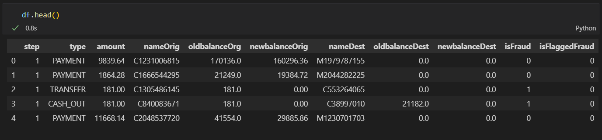
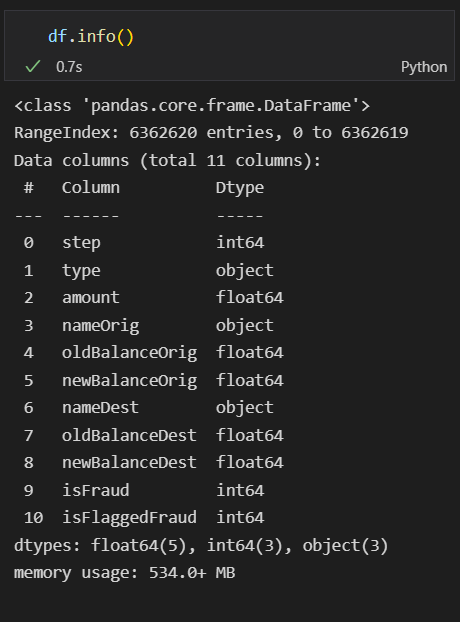

## Data Sources

Due to the private nature of financial data, there is a lack of publicly available datasets
that can be used for analysis. In this project, a synthetic dataset, publicly available on
Kaggle, generated using a simulator called PaySim is used. The dataset was generated
using aggregated metrics from the private dataset of a multinational mobile financial
services company, and then malicious entries were injected. (TESTIMON @ NTNU,
Kaggle).
The dataset contains 11 columns of information for ~6 million rows of data. The key
columns available are –

- Type of transactions
- Amount transacted
- Customer ID and Recipient ID
- Old and New balance of Customer and Recipient
- Time step of the transaction
- Whether the transaction was fraudulent or not

## Data Description

The data used for this analysis is a synthetically generated digital transactions dataset
using a simulator called PaySim. PaySim simulates mobile money transactions based on
a sample of real transactions extracted from one month of financial logs from a mobile
money service implemented in an African country. It aggregates anonymized data from
the private dataset to generate a synthetic dataset and then injects fraudulent
transactions.
The dataset has over 6 million transactions and 11 variables. There is a variable named
‘isFraud’ that indicates actual fraud status of the transaction. This is the class variable for
our analysis.
The columns in the dataset are described as follows:

| Name of the variable | Description                                                                                                                                                                                                                                                                                           |
| -------------------- | ----------------------------------------------------------------------------------------------------------------------------------------------------------------------------------------------------------------------------------------------------------------------------------------------------- |
| step                 | maps a unit of time in the real world. In this case 1 step is 1 hour of time. Total steps 744 (30 days simulation).                                                                                                                                                                                   |
| type                 | CASH-IN, CASH-OUT, DEBIT, PAYMENT and TRANSFER.                                                                                                                                                                                                                                                       |
| amount               | amount of the transaction in local currency.                                                                                                                                                                                                                                                          |
| nameOrig             | customer who started the transaction                                                                                                                                                                                                                                                                  |
| oldbalanceOrg        | initial balance before the transaction                                                                                                                                                                                                                                                                |
| newbalanceOrig       | new balance after the transaction                                                                                                                                                                                                                                                                     |
| nameDest             | customer who is the recipient of the transaction                                                                                                                                                                                                                                                      |
| oldbalanceDest       | initial balance recipient before the transaction. Note that there is not information for customers that start with M (Merchants).                                                                                                                                                                     |
| newbalanceDest       | new balance recipient after the transaction. Note that there is not information for customers that start with M (Merchants).                                                                                                                                                                          |
| isFraud              | This is the transactions made by the fraudulent agents inside the simulation. In this specific dataset the fraudulent behavior of the agents aims to profit by taking control or customers accounts and try to empty the funds by transferring to another account and then cashing out of the system. |
| isFlaggedFraud       | The business model aims to control massive transfers from one account to another and flags illegal attempts. An illegal attempt in this dataset is an attempt to transfer more than 200.000 in a single transaction.                                                                                  |
